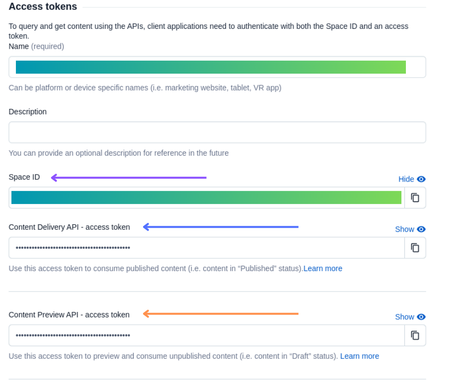

# Enabling Draft Previews for Contentful Development & Staging Environments

This article is a tutorial for enabling [Contentful Delivery API](https://www.contentful.com/developers/docs/references/content-delivery-api/) draft previews so that developers, quality assurance, and stakeholders can review and edit content drafts and extend features without changes interrupting content published on the production site.

---
## Files

### Add `CONTENTFUL_PARAMS` to your `constants.ts` file.
```ts
/* constants.ts */
export const CONTENTFUL_PARAMS: {
    host?: string | undefined,
    space: string | undefined,
    accessToken: string | undefined,
} = {
    // host defaults to cdn.contentful.com 
    host: (process.env.CONTENTFUL_DRAFT_MODE == 'true') ? 'preview.contentful.com' : undefined,
    space: process.env.CONTENTFUL_SPACE_ID,
    accessToken: (process.env.CONTENTFUL_DRAFT_MODE == 'true') 
        ? process.env.CONTENTFUL_PREVIEW_ACCESS_TOKEN
        : process.env.CONTENTFUL_ACCESS_TOKEN
}
```

### Import `CONTENTFUL_PARAMS` and export `contentfulClient` from `api.ts` file
```ts
/* api.ts */
const contentful = require('contentful')
/* assumption:  constants.ts is a sibling in the same directory as api.ts */
import { CONTENTFUL_PARAMS } from "./constants"

export const contentfulClient: any = contentful.createClient(CONTENTFUL_PARAMS)
```

### Add contentful `secrets` as `environment variables` for your various environments
```env
# Exclude CONTENTFUL_DRAFT_MODE or set to false for an 
# environment that drafts should not be displayed for
# such as production
CONTENTFUL_DRAFT_MODE = 'true'
CONTENTFUL_SPACE_ID = :space_id
CONTENTFUL_PREVIEW_ACCESS_TOKEN = :preview_access_token
CONTENTFUL_ACCESS_TOKEN = :access_token
```

### Generating Access Tokens
`CONTENTFUL_PREVIEW_ACCESS_TOKEN` and `CONTENTFUL_ACCESS_TOKEN` can be generated from  the `+ Add API key` button in `Settings` -> `API Keys` on the contentful site. Make sure to also copy the `Space ID` for `CONTENTFUL_SPACE_ID`.

<div align="center">
    
</div>

### Usage
Import `contentfulClient` where you would like to use the contentful client inline with the javascript api. [For example](https://www.contentful.com/developers/docs/references/content-delivery-api/#/reference/entries/entry/get-a-single-entry/console/js)
