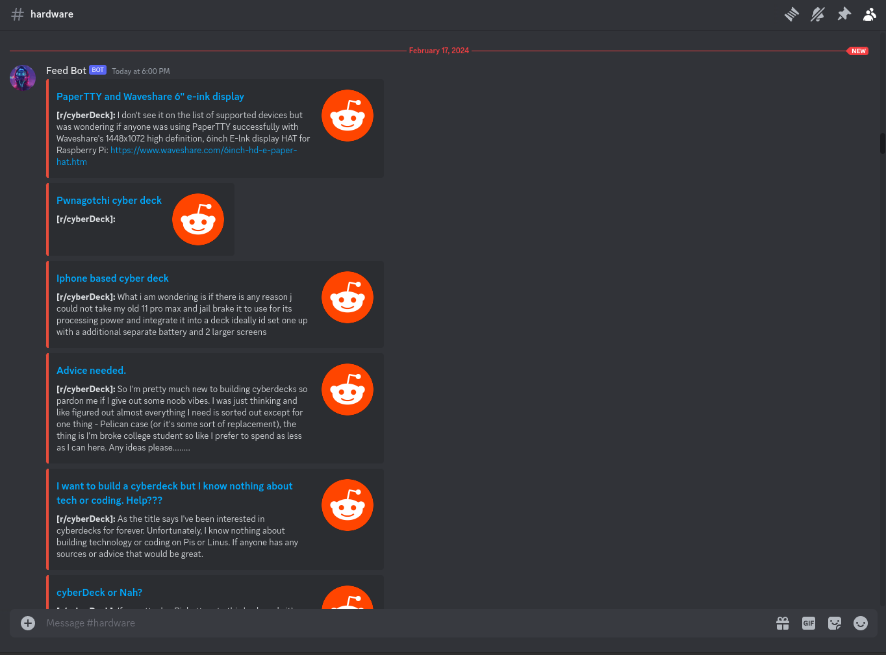
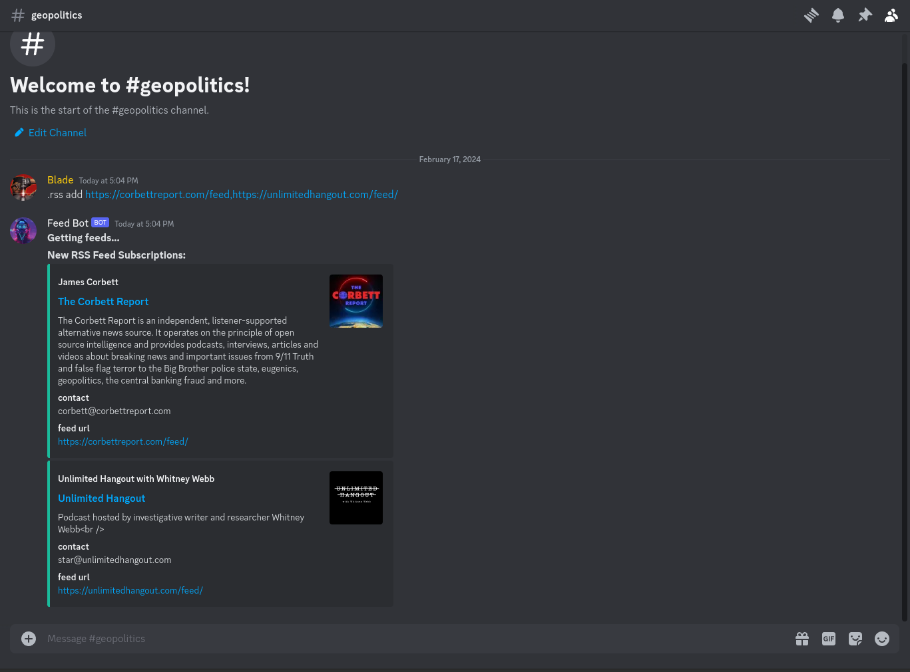

# Feed Bot


A discord bot for emulating an rss feed reader within your guild channels.

[Source Code](https://github.com/Audiosutras/feed_bot) - [Full Documentation](https://github.com/Audiosutras/feed_bot/blob/main/README.md) - [MIT License](https://github.com/Audiosutras/feed_bot/blob/main/MIT-LICENSE.txt) - [Issues](https://github.com/Audiosutras/feed_bot/issues) - [Releases](https://github.com/Audiosutras/feed_bot/releases) - [Docker Container Images](https://github.com/Audiosutras/feed_bot/pkgs/container/feed_bot)

**Note:** I am making this bot available under MIT license giving you the right to use my bot for commercial uses. I strongly encourage you to donate if
you have the means. Please click the `Tip Me` button to support my work.

---

## Table of Contents

- [Environment Variables](#environment-variables)
- [Deploying Feed Bot](#deploying-feed-bot)
- [Commands](#commands)

## Environment Variables

**For Discord:**

Add `BOT_TOKEN` environment variable. See the tutorial from `discord.py` on how to [create a bot account](https://discordpy.readthedocs.io/en/stable/discord.html?highlight=creating%20bot%20account).

Make sure to enable the `Message Content` intent for the bot whose token you are using. The bot will also need the `Send Messages` permission as part of granting the bot access to your server.

**For Reddit:**

Add the following environment variables:

```env
REDDIT_CLIENT_ID=<application_id> # sent in email from reddit after registering app
REDDIT_CLIENT_SECRET=<client_secret>
REDDIT_USERNAME=<username>
REDDIT_PASSWORD=<password_to_login_to_reddit>
REDDIT_USER_AGENT=<custom_user_agent>
```

See [asyncpraw documentation](https://asyncpraw.readthedocs.io/en/latest/getting_started/authentication.html) for more information.

**For Images:**

`IMAGES_URL` specifies a url to a cloudfront distribution or s3 url where your images are stored and can be fetched. The `IMAGES_URL` constant is accessed via the `CommonUtilities` class. `Images_Url` returns an empty string if not set.

**For Managing Environment Variables:**

For managing environment variables we suggest using [direnv](https://direnv.net/docs/installation.html)

This is what our `.envrc` should look like.

```envrc
export BOT_TOKEN=<discord_bot_token_from_developer_portal>
export REDDIT_CLIENT_ID=<application_id> # sent in email from reddit after registering app
export REDDIT_CLIENT_SECRET=<client_secret>
export REDDIT_USERNAME=<username>
export REDDIT_PASSWORD=<password_to_login_to_reddit>
export REDDIT_USER_AGENT=<custom_user_agent>
export IMAGE_URL=<cloudfront_distribution_url_or_s3_url>
```

## Deploying Feed Bot

There are a variety of options available to you for deploying `Feed Bot` including on your machine. We will share with you how to deploy this bot to a [Digital Ocean](https://m.do.co/c/b82b00e77afc) droplet. We are choosing Digital Ocean for:

1. ease of use through the GUI and [CLI](https://docs.digitalocean.com/reference/doctl/)
2. 100% uptime and resilient infrastructure that only a cloud platform can provide

Whether hosting on Digital Ocean, another provider, or your local machine make sure that you have [Docker](https://docs.docker.com/) installed.

- Once Docker is installed create a directory called `feed_bot`.
- Inside of this directory create a `compose.yaml` file.
- Copy the contents of [compose-prod.yaml](https://github.com/Audiosutras/feed_bot/blob/main/compose-prod.yaml) and paste it into the `compose.yaml` file and save the file.
- Now **make sure** to export [environment variables](#environment-variables)
- After exporting environment variables you can run the project with `docker compose up -d`. To see the bot in action run `docker compose logs --follow bot`

**[Digital Ocean](https://m.do.co/c/b82b00e77afc) Recommendations**

- After creating a project for your bot(s), `Create` a droplet. The `Create` button can be found in the `Droplets` section.
- Choose the region closest to your end users. If this is just you, choose the region closest to you.
- Choose the operating system that you are most familiar with. For demonstration lets stick with `Ubuntu`.
- Stick with `Basic` for Droplet Size.
- Select `Premium AMD` and the `$7/mo` plan
- Choose `SSH Key` for Authentication Method (This is for CLI Access). If this is your first time using Digital Ocean you should be prompted to upload an SSH key otherwise this can be found in `Settings`
- Under `Finalize Details`, change the field for `Hostname` to something easy and memorable
- Click `Create Droplet`

**Interact with your droplet**

Run:

```bash
$ doctl compute ssh <hostname>
```

Once in the virtual machine we are going to add docker, direnv, and our `Feed Bot` directory

```bash
$ snap install docker
$ apt install direnv
$ echo 'eval "$(direnv hook bash)"' >> .bashrc
$ mkdir feed_bot && cd feed_bot
```

Head to the [environment variables](#environment-variables) section and add the env vars.

```bash
# ~/feed_bot
$ touch .envrc
$ vim .envrc # add the environment variables key/value pairs and to save (:wq + ENTER)
$ direnv allow . # you may need to close and reopen the connection to the droplet for direnv to be functional
```

If you read above you know we'll need to copy the contents of [compose-prod.yaml](https://github.com/Audiosutras/feed_bot/blob/main/compose-prod.yaml) into a created `compose.yaml` file.

```bash
# ~/feed_bot
$ touch compose.yaml
$ vim compose.yaml # paste contents of compose-prod.yaml when ready to save do (:wq + ENTER)
```

Now lets run the bot in the background and see what it is doing.

```bash
# ~/feed_bot
$ docker compose up -d
$ docker compose logs --follow bot
```

To close the logs type `CTRL/CMD + C` and to close the ssh connection type `exit` in the terminal.

Now re-read the [create a bot account](https://discordpy.readthedocs.io/en/stable/discord.html?highlight=creating%20bot%20account) `discord.py` tutorial. The only thing that is left to do is invite the bot to the discord server(s) you want it in.

### Commands

**File Commands: Commands for exporting channel subscriptions**

- Permissions: Channel members can export a channel's subscriptions


| Command   | Description                                                                   |
| --------- | ----------------------------------------------------------------------------- |
| `.export` | Sends a generated .txt file of all the channel's subscriptions to the channel |

**Reddit Commands: RSS like updates for subreddits within channels**

- Permissions: Only a guild owner can invoke these commands.



| Command                | Description                                            | Example                                                      |
| ---------------------- | ------------------------------------------------------ | ------------------------------------------------------------ |
| `.subreddit ls`        | List the subreddits this channel subscribes to.        | `.subreddit ls`                                              |
| `.subreddit add <arg>` | Add subreddit(s) as an rss feed for this channel.      | `.subreddit add cyberDeck,r/ROS` or `.subreddit add r/linux` |
| `.subreddit rm <arg>`  | Remove rss feed of subreddit(s) from this channel      | `.subreddit rm r/cyberDeck` or `.subreddit rm r/ROS,r/linux` |
| `.subreddit prune`     | Removes all subreddit rss feeds within a given channel | `.subreddit prune`                                           |

**RSS Feed Commands: RSS feed updates within your guild channels**

- Permissions: Only a guild owner can invoke these commands.



| Command          | Description                                         | Example                                                                                                                                              |
| ---------------- | --------------------------------------------------- | ---------------------------------------------------------------------------------------------------------------------------------------------------- |
| `.rss ls`        | List the RSS Feeds that this channel subscribes to. | `.rss ls`                                                                                                                                            |
| `.rss add <arg>` | Adds website rss feeds to the channel.              | `.rss add https://corbettreport.com/feed` or `.rss add https://unlimitedhangout.com/feed/,https://corbettreport.com/feed/` \*trailing slash optional |
| `.rss rm <arg>`  | Removes specific rss feeds from channel.            | `.rss rm https://corbettreport.com/feed` or `.rss rm https://unlimitedhangout.com/feed/,https://corbettreport.com/feed/` \*trailing slash optional   |
| `.rss prune`     | Removes all web rss feeds within a given channel.   | `.rss prune`                                                                                                                                         |
