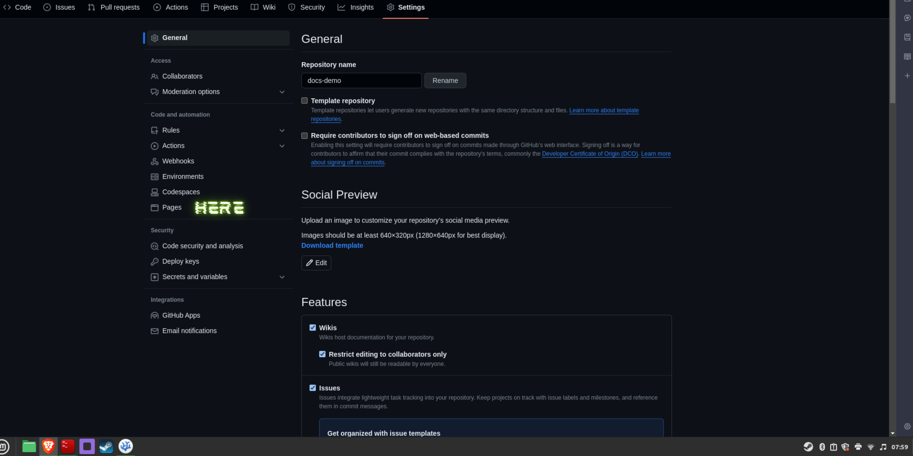
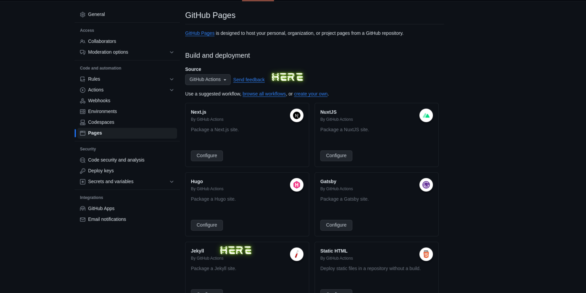
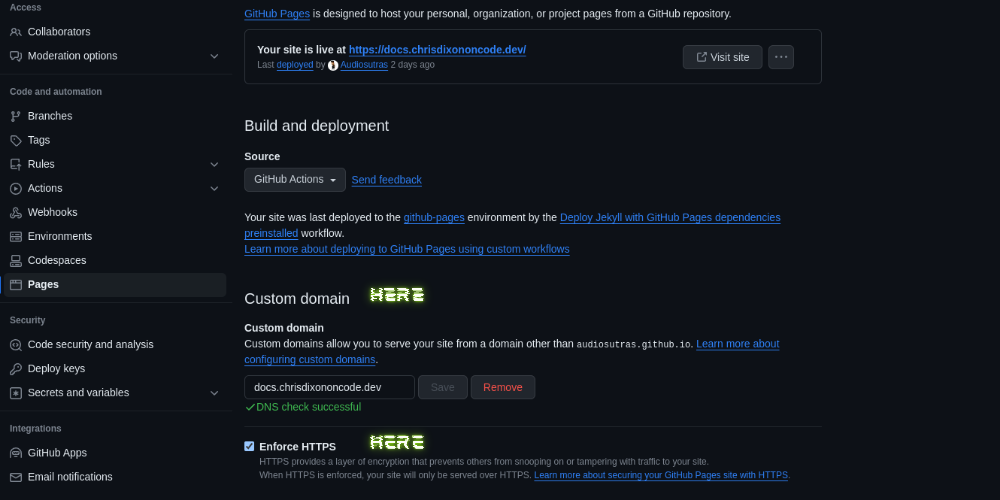

# Hosting Documentation Using Github Pages & Jekyll

The github repo for [docs.chrisdixononcode.dev](https://github.com/Audiosutras/documentation) and [getdat](https://github.com/Audiosutras/getdat) are good examples to follow alongside this documentation if needed. `getdat` demonstrates hosting documentation for a python package.

### Table of Contents

- [Initial Local Setup](#initial-local-setup)
- [Repository Setup](#repository-setup)
  - [Jekyll Config](#jekyll-config)
  - [Gemfile](#gemfile)
  - [Customizing Styling & HTML](#customizing-styling--html)
- [Using a Sub-Domain For Your Github Pages Site](#using-a-sub-domain-for-your-github-pages-site)
  - [Update the Domain Name Registrar](#update-the-domain-name-registrar)
  - [Update the Repository and Github](#update-the-repository-and-github)

## Initial Local Setup

Locally on your machine follow the [installation guide](https://jekyllrb.com/docs/installation/#guides) for your operating system to get jekyll installed so we can customize and make changes to the site before pushing to production. I'm currently on linux mint so I will follow the installation guide for Ubuntu.

- Install Ruby and othe prerequisites:

  ```bash
  sudo apt update
  sudo apt install ruby-full build-essential zlib1g-dev
  ```

- Configure Path to Gems. I use zsh so will be updating `.zshrc`. If using bash replace `~/.zshrc` with `~/.bashrc`:

  ```bash
  echo '# Install Ruby Gems to ~/gems' >> ~/.zshrc
  echo 'export GEM_HOME="$HOME/gems"' >> ~/.zshrc
  echo 'export PATH="$HOME/gems/bin:$PATH"' >> ~/.zshrc
  source ~/.zshrc
  ```

- Install Jekyll and Bundler

  ```bash
  gem install jekyll bundler
  ```

## Repository Setup

For an existing or newly created github repository head to `Settings` and under `Code and automation` click on `Pages`.



Ensure that `Github Actions` is your `Source` under `Build and deployment`. Scroll down to `Jekyll` and click `Configure`.



Clicking `Configure` will open an editor in github for you to review the workflow for this github action. Click `Commit Changes`, the action will be created and added to`.github/workflows/<something with jekyll in the title>.yml`.

Pull down these changes to your local branch. Replace the contents of this file with the following to support our setup and tell github actions to build our jekyll site from the contents of the `docs/` directory.

```yml
# Sample workflow for building and deploying a Jekyll site to GitHub Pages
name: Deploy Jekyll with GitHub Pages dependencies preinstalled

on:
  # Runs on pushes targeting the default branch
  push:
    branches: ["master"] # update this if using 'main', 'trunk', 'development', etc.

  # Allows you to run this workflow manually from the Actions tab
  workflow_dispatch:

# Sets permissions of the GITHUB_TOKEN to allow deployment to GitHub Pages
permissions:
  contents: read
  pages: write
  id-token: write

# Allow only one concurrent deployment, skipping runs queued between the run in-progress and latest queued.
# However, do NOT cancel in-progress runs as we want to allow these production deployments to complete.
concurrency:
  group: "pages"
  cancel-in-progress: false

jobs:
  # Build job
  build:
    runs-on: ubuntu-latest
    steps:
      - name: Checkout
        uses: actions/checkout@v3
      - name: Setup Pages
        uses: actions/configure-pages@v3
      - name: Build with Jekyll
        uses: actions/jekyll-build-pages@v1
        with:
          source: ./docs # IMPORTANT Build our site from the contents of the docs directory in the root repository.
          destination: ./_site
      - name: Upload artifact
        uses: actions/upload-pages-artifact@v2

  # Deployment job
  deploy:
    environment:
      name: github-pages
      url: ->{{ steps.deployment.outputs.page_url }}
    runs-on: ubuntu-latest
    needs: build
    steps:
      - name: Deploy to GitHub Pages
        id: deployment
        uses: actions/deploy-pages@v2
```

Before committing this file lets:

- update `.gitignore` to exclude the `_site/` directory

  ```.gitignore
  /docs/_site/
  _site/

  # other contents
  ```

- Add files and directories for configuration and customization. Below is the layout for `docs/`

```txt
| docs
    | ReadMe.md (entry point to site: '/')
    | second_page.md ('/second_page.html')
    | other markdown files
    | assets (optional: 'assets/')
        | css (customization - optional)
            | style.scss (customization - optional)
        | images (optional)
    | _includes (customization - optional)
    | _layouts (customization - optional)
    | Gemfile (local development - optional)
    | Gemfile.lock (auto-generated - local development - optional)
    | _config.yml
```

### Jekyll Config

Add the following contents to `_config.yml`. This example `_config.yml` file uses `pages-themes/hacker`. You can choose a different theme [here](https://github.com/pages-themes). Note that [show_downloads](https://github.com/pages-themes/hacker/blob/4c942506cf8d5329a9cbc66b1eff75ad86a49e34/_layouts/default.html#L22-L26) and [google_analytics](https://github.com/pages-themes/hacker/blob/master/_includes/head-custom-google-analytics.html) are optional and be overwritten which we will get to shortly.

```yaml
lsi: false
safe: true
title: <title>
description: <description of site>
# optional
show_downloads: true
# optional
google_analytics: <google_analytics>
incremental: false
highlighter: rouge
gist:
  noscript: false
kramdown:
  math_engine: mathjax
  syntax_highlighter: rouge
# make sure to select a theme if you don't want to go with hacker.
remote_theme: pages-themes/hacker@v0.2.0 # https://github.com/pages-themes/hacker
plugins:
  - jekyll-remote-theme # add this line to the plugins list if you already have one
```

### Gemfile

The `Gemfile` is important for local development. Add the following:

```Gemfile
source "https://rubygems.org/"

gem 'github-pages', group: :jekyll_plugins
gem "webrick"
```

After adding this file you should be able to start a local development server that runs at `https://127.0.0.1:4000`.

```bash
bundler install
# bundler install only needs to be run initially
bundler exec jekyll build
# remember to build pages once they have been added
bundler exec jekyll serve
```

_Note - at this point you can commit and push changes and check that your documentation is hosted at `https://<github_username>.github.io/<repository_name>` after confirming that local development is working properly_

### Customizing Styling & HTML

For adding your own styles create a `styles.scss` file in `docs/assets/css/`. For changes to take effect with your custom styles you may need to add `!important` at the end of a property's value.

```scss
---
---

@import "{{ site.theme }}";

/* Your custom styles */
```

For adding HTML you will need to override `_layouts` and `_includes` directories with a replacement file for what you want to edit. Its best to check the documentation and source code for the theme that has been selected. For example with hacker I've consulted this [section](https://github.com/pages-themes/hacker#customizing) for building this [site](https://github.com/Audiosutras/documentation)

This is important if you would like to add a custom navigation, footer, favicon, or use a css framework to style your documentation inline with an existing site. For example if you click on [Home](https://chrisdixononcode.dev) and navigate back to this documentation page you will see that you have changed domains to `https://chrisdixoncode.dev` to `https://docs.chrisdixononcode.dev` and back again.

## Using a Sub-Domain for Your Github Pages Site

### Update the Domain Name Registrar

Head over to the DNS registar where you purchased the domain you would like to sub-domain. Add a CNAME record to that domain's DNS records for it be used as your github pages new domain. For example, `chrisdixononcode.dev` is the domain. To create `docs.chrisdixononcode.dev` subdomain for `<github_username>.github.io` you add the following:

```txt
RECORD TYPE: CNAME
NAME: docs
VALUE: <github_username>.github.io
TIME TO LIVE (TTL): 3600
```

_Note - you can follow this format as much as you would like for repositories hosted with github pages. Just change the `NAME` value that determines the actually subdomain_

### Update the Repository and Github

In the repository you would like to have a custom domain for add a file in your `docs/` directory called `CNAME`. Within this file write the _full_ custom domain and then commit and push this file to the repository. For example:

```txt
# first line of CNAME file
docs.chrisdixononcode.dev

```

From the Github GUI navigate to `Settings`. Under `Code and automation` click `Pages` and then under `Custom domain` add your subdomain and click `Save`. Underneath make sure `Enfore HTTPS` is checked.


